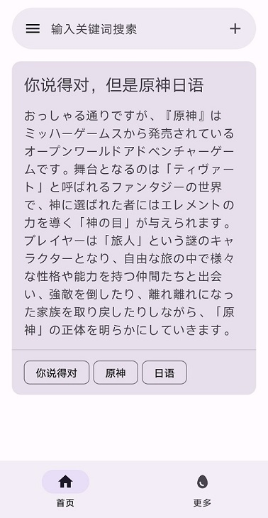
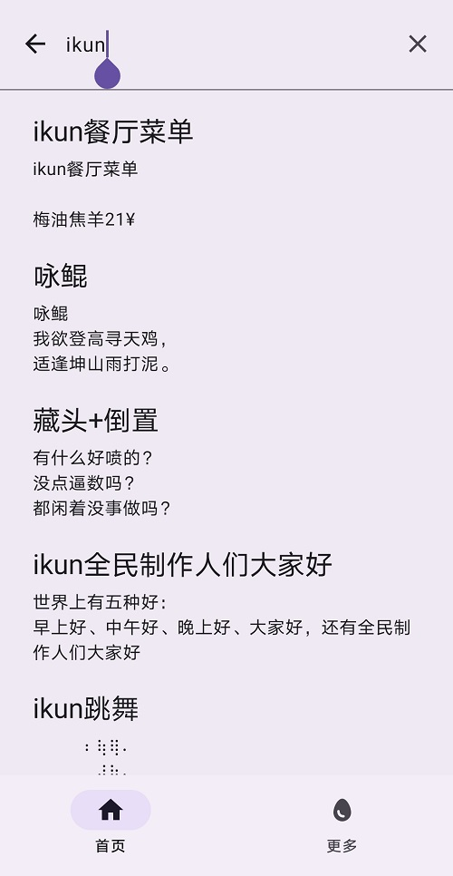
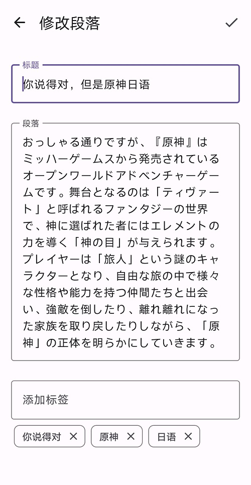
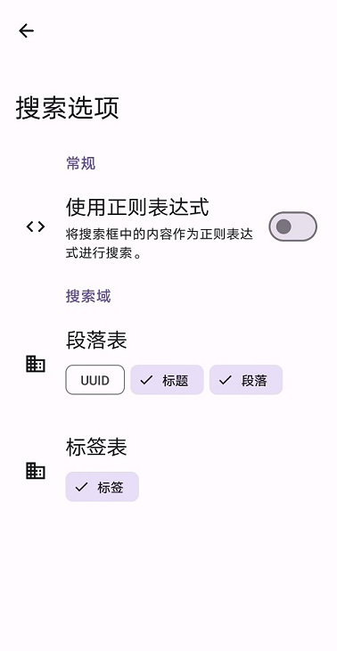
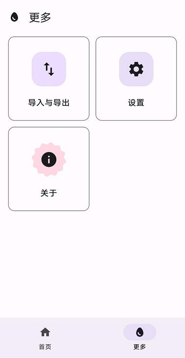
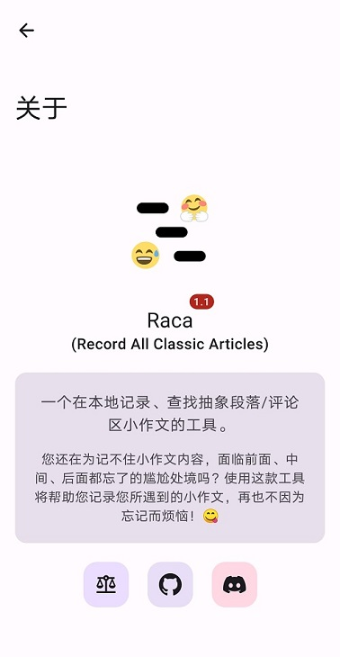

    

        
    

    <h1>😅 Raca (Android)</h1>
    

        
        
        
        
	

    

        <b>Raca (Record All Classic Articles)</b>，一个在本地<b>记录、查找抽象段落/评论区小作文</b>的工具。
    

    

        您还在为记不住小作文内容，面临<b>前面、中间、后面都忘了</b>的尴尬处境吗？使用这款工具将<b>帮助您记录您所遇到的小作文</b>，再也不因为忘记而烦恼！😋
    

    

        使用<b> MVI </b>结构，完全采用<b> Material You </b>设计风格。<b>所有页面均使用 Jetpack Compose </b>开发。
    

    

        <a href="https://github.com/SkyD666/Raca" style="text-decoration:none" >
            🖥️桌面端请点击这里
        </a>
    

## 💡主要功能

1. 支持为段落打**标签**
2. 支持设置**搜索域**（设置搜索**数据库表的字段**）
3. 支持使用**正则表达式搜索**
4. 支持**导入导出数据库**为文件
5. 支持**使用 WebDAV 同步**数据
6. 支持根据关键词**自动填充**输入框
7. 支持通过选中段落后的**上下文菜单快捷添加段落**
8. 支持**深色模式**
9. ......

## 🤩应用截图

 
 
 
 
 

## 🛠主要技术栈

- Jetpack **Compose**
- **MVI** Architecture
- **Material You**
- **ViewModel**
- **Hilt**
- Room
- Splash Screen
- Navigation
- Profile Installer

## 📃许可证

使用此软件代码需**遵循以下许可证协议**

[**GNU General Public License v3.0**](LICENSE)
